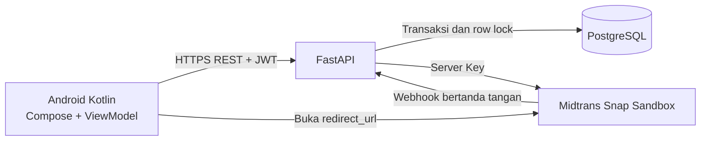
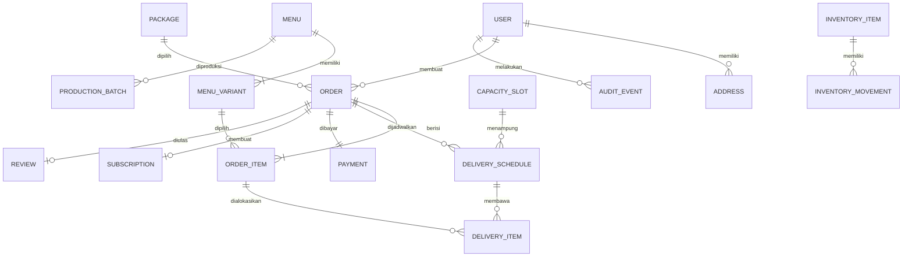

# Arsitektur LaukSatSet

Untuk panduan fitur dan alur lengkap per peran, lihat [Dokumentasi Fitur dan Alur](DOKUMENTASI_FITUR_DAN_ALUR.md).

Android tidak pernah mengakses PostgreSQL dan tidak menyimpan Server Key. FastAPI menghitung ulang harga, memeriksa cut-off, mengunci baris slot dengan `SELECT ... FOR UPDATE`, lalu menyimpan order, item, jadwal, reservasi kapasitas, dan pembayaran dalam satu transaksi. Status pembayaran hanya menjadi final lewat webhook terverifikasi atau rekonsiliasi server.

## Relasi inti

Status `Payment`, `Order`, `DeliverySchedule`, dan `ProductionBatch` disimpan terpisah. `OrderItem` menyimpan snapshot nama, varian, dan harga agar histori tidak berubah ketika katalog diedit.

## Batas akses

- Pelanggan hanya dapat membaca order dan alamat miliknya.
- Admin dapat membaca seluruh order, ringkasan keuangan, dan melakukan transisi operasional.
- Tim dapur hanya mendapat daftar produksi dan transisi produksi/QC yang diizinkan.
- Semua pemeriksaan berada di backend melalui JWT dan dependency berbasis peran.
