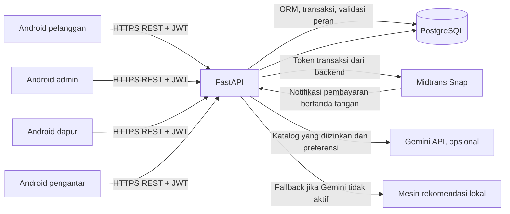
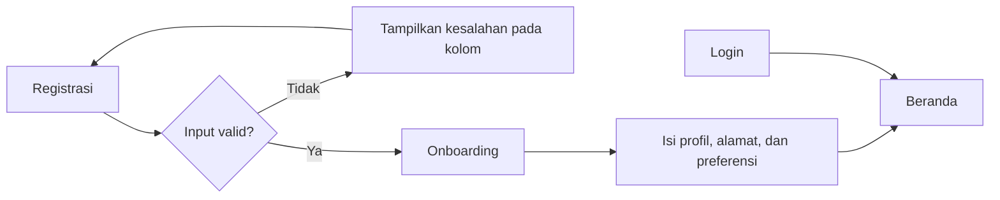
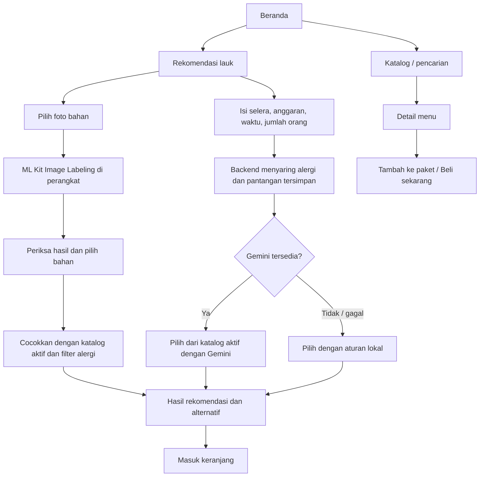
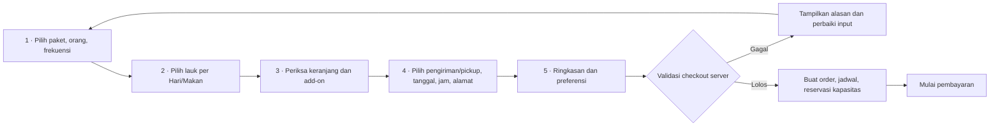
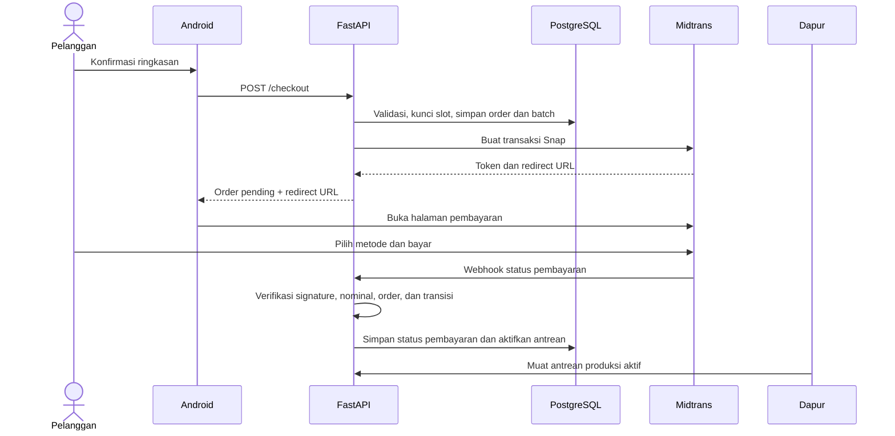
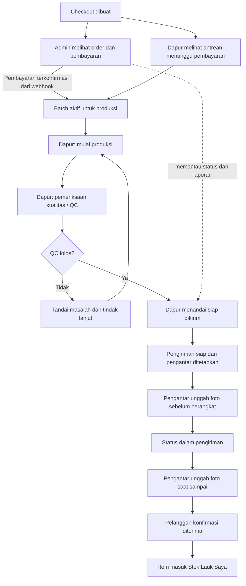
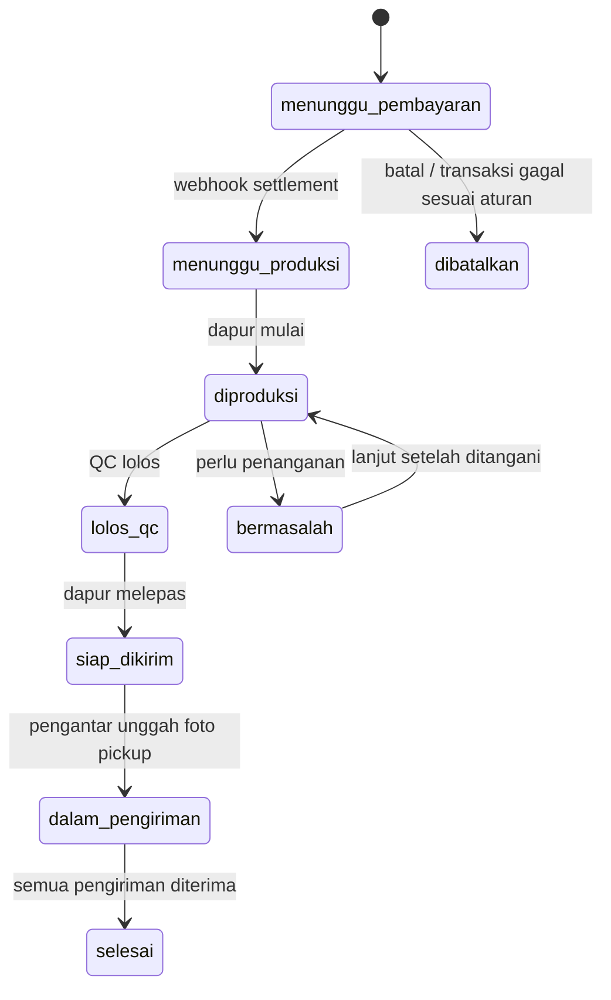
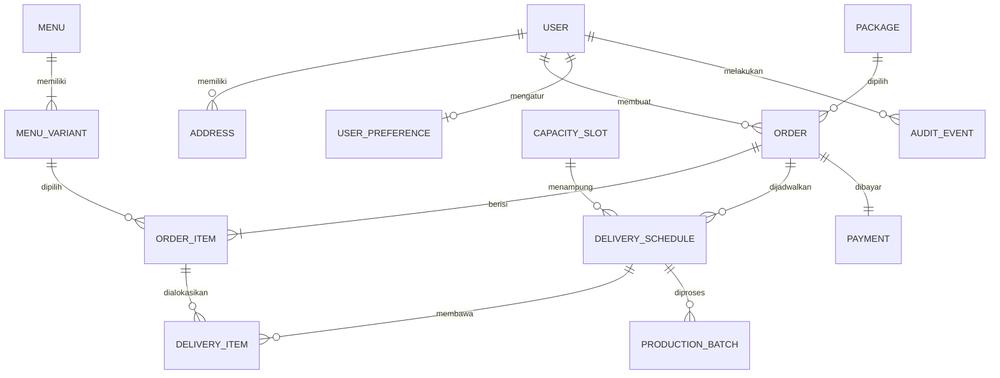

# Dokumentasi Fitur dan Alur LaukSatSet

**Versi yang didokumentasikan:** Android 0.17.0 (version code 18)

**Jenis aplikasi:** Android native dengan Jetpack Compose  
**Bahasa:** Kotlin pada aplikasi; Python/FastAPI pada backend  
**Peran pengguna:** Pelanggan, Admin, Dapur, dan Pengantar

Dokumen ini menjelaskan fungsi aplikasi, perjalanan pengguna, perubahan status, dan hubungan antarkomponen. Diagram memakai Mermaid; GitHub dan editor Markdown yang mendukung Mermaid akan menampilkannya sebagai gambar.

## 1. Ringkasan produk

LaukSatSet membantu pelanggan memilih lauk siap masak atau siap makan, menyusun menu untuk beberapa hari, menentukan jadwal dan cara menerima pesanan, lalu membayar melalui Midtrans. Pesanan yang dibuat tercatat pada admin dan dapur. Pembayaran yang terkonfirmasi mengaktifkan pekerjaan produksi. Tim dapur mengatur proses memasak dan pemeriksaan kualitas, lalu melepas pengiriman kepada pengantar. Pelanggan dapat memantau pesanan dan mengelola stok lauk yang sudah diterima.

Android berkomunikasi dengan FastAPI melalui REST. FastAPI menerapkan aturan bisnis, otorisasi, validasi checkout, serta komunikasi dengan PostgreSQL dan penyedia pembayaran. Gemini digunakan dari backend untuk memberi rekomendasi jika API key tersedia; aturan lokal menjadi cadangan.

## 2. Peta fitur berdasarkan peran

| Peran | Fitur utama | Hasil yang diharapkan |
|---|---|---|
| Pelanggan | Registrasi/login, profil, alamat, katalog dan pencarian, rekomendasi, susun paket, checkout, pembayaran, status pesanan, stok, masak, ulasan, dan komplain | Pesanan yang valid, dapat dibayar dan dilacak sampai diterima; lauk diterima masuk ke Stok Lauk Saya |
| Admin | Ringkasan, analisis grafik, ekspor CSV, detail pesanan, pengelolaan menu/paket/slot, pengguna, pengantar, dan inbox masukan | Operasi usaha dapat dipantau dan data katalog/jadwal dapat dikelola |
| Dapur | Antrean produksi, jumlah per menu dan tanggal, add-on, catatan, alergi, target selesai, konfirmasi status/QC, profil | Batch selesai diperiksa lalu ditandai siap untuk diambil pengantar |
| Pengantar | Daftar tugas menurut jadwal, alamat/customer, bukti foto sebelum berangkat dan saat tiba, hubungi pelanggan, statistik dan profil | Pengiriman dimulai hanya setelah dapur melepas pesanan dan memiliki bukti perjalanan |

## 3. Arsitektur aplikasi

### Pembagian tanggung jawab

- **Aplikasi Android** menampilkan layar, mengumpulkan input, menjaga state wizard/keranjang, memvalidasi input dasar, dan membuka Maps, telepon, atau halaman pembayaran.
- **FastAPI** memverifikasi token dan role, menerapkan transisi status, menghitung total harga, memeriksa kapasitas slot, menyaring menu rekomendasi, menyimpan order, dan menghubungi Midtrans/Gemini.
- **PostgreSQL** menyimpan akun, alamat, menu/varian, paket, kapasitas slot, order, item order, jadwal pengiriman, pembayaran, batch produksi, stok pelanggan, ulasan, komplain, serta audit.
- **Midtrans** memproses pembayaran hosted Snap. Status final pembayaran berasal dari notifikasi server yang diverifikasi backend.
- **Gemini** hanya memberi pilihan dari katalog aktif yang dikirim backend. Server membatasi pilihan dan memeriksa hasilnya. API key tidak ditanam dalam APK.

## 4. Alur pelanggan

### 4.1 Registrasi sampai beranda

Registrasi memeriksa format dan kelengkapan input lalu menampilkan pesan yang menjelaskan bagian yang perlu dibetulkan. Pengguna dapat login dengan akun server. APK juga menyediakan akun demo untuk mencoba antarmuka ketika backend tidak dapat diakses; mode demo tidak membuat transaksi Midtrans atau menyimpan data ke database server.

### 4.2 Memilih lauk atau meminta rekomendasi

Preferensi yang dapat dipakai rekomendasi mencakup alergi, bahan yang dihindari, target kalori, aktivitas, tujuan kebugaran, dan frekuensi makan. Backend menyaring menu berdasarkan alergi/pantangan sebelum hasil dipilih. Rekomendasi tidak menggantikan pemeriksaan komposisi pada label produk.

**Pemindai bahan:** pelanggan memilih foto dari galeri. Model dasar ML Kit Image Labeling berjalan di perangkat; aplikasi menampilkan label beserta tingkat keyakinan, lalu mencocokkan bahan yang dikenali dengan bahan pada katalog. Pelanggan dapat mengoreksi pilihan bahan secara manual sebelum melihat menu yang cocok. Gambar tidak dikirim ke backend. Pengenalan bersifat perkiraan dan tidak boleh dipakai untuk memastikan keamanan pangan atau ketiadaan alergen.

### 4.3 Menyusun paket dan checkout

Paket yang diketuk dari Beranda langsung menjadi paket aktif. Pelanggan melewati wizard lima langkah berikut.

**Langkah 1 — Paket dan kebutuhan makan.** Pelanggan memilih durasi paket, jumlah orang, dan frekuensi makan harian. Contohnya paket 7 hari dengan 2 kali makan menghasilkan 14 posisi lauk. Paket empat minggu dengan 3 kali makan mendukung 84 posisi.

**Langkah 2 — Pilihan lauk.** Setiap hari dan waktu makan memiliki kartu sendiri, sehingga menu serta varian dapat berbeda. Untuk mempercepat pengisian, pelanggan dapat memakai satu menu untuk semua posisi, menyalin susunan Hari 1, atau menempel susunan tersimpan dari pesanan sebelumnya. Tempel memeriksa bahwa varian masih aktif serta jumlah waktu makan cocok.

**Langkah 3 — Keranjang.** Menu diringkas per hari dengan kartu yang konsisten. Pelanggan dapat mengganti atau menghapus item melalui konfirmasi, mengatur porsi, tingkat pedas, catatan, dan add-on nasi, sambal, atau kerupuk.

**Langkah 4 — Jadwal.** Pelanggan memilih diantar atau ambil sendiri, lalu memilih tanggal dan rentang jam. Satu hari memakai satu jadwal pengiriman untuk semua lauk hari tersebut. Satu pesanan memakai satu alamat tujuan utama untuk seluruh jadwal. Untuk pickup, aplikasi menampilkan alamat dapur dan tautan Google Maps.

**Langkah 5 — Ringkasan.** Pelanggan memeriksa lauk, porsi, add-on, alamat atau lokasi pickup, jadwal, preferensi, ongkir, diskon, dan total sebelum konfirmasi pembayaran.

Server menghitung ulang harga. Server memeriksa jumlah posisi, paket aktif, kepemilikan alamat, tanggal, cut-off, slot aktif, kapasitas, varian aktif, dan aturan satu jadwal per hari. Reservasi kapasitas dilakukan dalam transaksi database dengan penguncian slot untuk mencegah slot terakhir terjual dua kali.

### 4.4 Pembayaran dan aktivasi produksi

Pada lingkungan nyata, pelanggan membayar melalui Midtrans. Webhook yang sah memperbarui status pembayaran dan mengaktifkan batch. Simulator pembayaran hanya tersedia pada konfigurasi demo tertentu; hasil simulasi bukan bukti pembayaran nyata.

### 4.5 Pesanan, penerimaan, dan stok

Pelanggan dapat melihat status pembayaran, rincian item, jadwal per pengiriman, alamat, dan timeline. Sebelum produksi dimulai, sesuai aturan backend, pelanggan dapat membatalkan pesanan yang belum dibayar atau mengajukan perubahan alamat/jadwal yang diizinkan. Ketika pengiriman sudah dilakukan, pelanggan dapat mengonfirmasi penerimaan, membuat laporan masalah dengan foto, dan memberi ulasan setelah pesanan selesai.

Setelah penerimaan dikonfirmasi, item pengiriman masuk ke **Stok Lauk Saya**. Status stok dan tanggal anjuran penggunaan dicatat pada alokasi item pengiriman. Dari sana pelanggan dapat membaca petunjuk simpan, membuka instruksi **Masak**, menandai lauk sudah dimasak, atau melaporkan masalah. Tanggal anjuran penggunaan merupakan informasi produk, bukan jaminan keamanan pangan.

## 5. Alur operasional admin, dapur, dan pengantar

### Admin

- **Ringkasan:** jumlah order, pembayaran yang perlu ditangani, produksi, pengiriman siap, pendapatan dari pembayaran settlement, grafik penjualan/pemasukan, serta ringkasan cara menerima pesanan.
- **Periode grafik:** Mingguan, Bulanan, dan Tahunan. Mode offline dapat menampilkan data contoh untuk demonstrasi; angka demo bukan data transaksi usaha.
- **Pesanan:** filter tanggal, lihat detail operasional, pembayaran, isi order, jadwal, dan timeline. Tombol Sukses/Gagal hanya untuk simulasi pembayaran ketika mode demo aktif dan meminta konfirmasi kedua.
- **Kelola produk:** tambah/edit/arsip menu, foto produk, harga varian, bahan/alergen, porsi/kalori, instruksi, durasi langkah, peralatan, penyimpanan, dan tanda matang.
- **Kelola pengiriman:** kalender slot, kapasitas, ongkir, penetapan pengantar, riwayat, dan ekspor laporan.
- **Masukan dan pengguna:** lihat data pelanggan/pengantar serta inbox saran dan komplain.

Admin mengamati status produksi, tetapi tidak memutuskan status QC atau siap kirim. Perubahan operasional tersebut dilakukan dapur.

### Dapur

Antrean produksi diurutkan mengikuti waktu pengiriman terdekat. Kartu batch menampilkan nama menu, jumlah pack, varian, tingkat pedas, add-on, catatan, alergen, waktu target selesai, dan tahap saat ini. Perubahan tahap meminta konfirmasi kedua. Dapur menjalankan `menunggu_produksi → diproduksi → lolos_qc → siap_dikirim`; bila ada kendala, status dapat diarahkan ke penanganan masalah.

Saat batch untuk suatu pengiriman sudah lolos dan ditandai siap, backend melepas pengiriman kepada pengantar dan membuat audit event. Jika pengantar belum ditentukan manual, backend memilih pengantar dengan beban tugas aktif paling sedikit. Aplikasi dapur juga menampilkan ringkasan persiapan H-1 dan menjadwalkan pengingat 30 serta 10 menit sebelum jadwal.

### Pengantar

Bottom navigation menyediakan halaman **Tugas** dan **Profil**. Daftar tugas berisi tanggal/jam, nomor order, penerima, telepon, dan alamat. Tombol mulai antar hanya aktif setelah dapur menandai siap. Pengantar wajib mengunggah foto barang sebelum berangkat, lalu foto saat sampai. Pengantar dapat menghubungi pelanggan melalui dialer perangkat.

## 6. Status utama

### Status pembayaran

| Status | Makna |
|---|---|
| `pending` | Pembayaran belum dikonfirmasi penyedia |
| `settlement` | Pembayaran berhasil dan terkonfirmasi |
| `gagal` / `deny` | Pembayaran gagal atau ditolak |
| `kedaluwarsa` | Batas waktu transaksi terlewati |

Backend memvalidasi signature, order ID, nominal transaksi, dan transisi status. Callback tampilan Android tidak cukup untuk menetapkan pembayaran sukses.

### Status order dan produksi

Untuk paket dengan beberapa jadwal, `DeliverySchedule` menyimpan status setiap pengiriman. Item paket dialokasikan ke jadwal masing-masing melalui `DeliveryItem`. Satu order dapat selesai setelah semua pengiriman terkait diterima.

## 7. Model data inti

Nama menu, varian, dan harga pada `OrderItem` merupakan snapshot saat pemesanan. Perubahan katalog di masa depan tidak mengubah rincian order lama. `Payment`, `Order`, `DeliverySchedule`, dan `ProductionBatch` memiliki status masing-masing agar alur uang, order, jadwal, dan produksi dapat dilacak terpisah.

## 8. API backend menurut domain

Dokumentasi OpenAPI interaktif tersedia pada `/docs` saat backend berjalan.

| Domain | Endpoint penting |
|---|---|
| Autentikasi dan akun | `POST /auth/login`, `POST /auth/register`, `POST /auth/forgot-password`, `POST /auth/reset-password`, `GET /me`, `POST /me/password` |
| Preferensi dan katalog | `GET/PUT /me/preferences`, `GET /catalog`, `POST /recommendations`, `POST /recommendations/options` |
| Slot dan alamat | `GET /delivery-slots`, `GET/POST /me/addresses`, `PATCH/DELETE /me/addresses/{id}` |
| Pemesanan dan pembayaran | `POST /checkout`, `GET /orders`, `GET /orders/{id}`, `POST /orders/{id}/retry-payment`, `POST /payments/webhook` |
| Pengelolaan order pelanggan | `POST /orders/{id}/cancel`, `PATCH /orders/{id}/address`, `PATCH /deliveries/{id}/reschedule`, `POST /me/deliveries/{id}/receive`, `POST /deliveries/{id}/problem`, `POST /orders/{id}/review` |
| Admin | `GET /admin/summary`, `GET /admin/users`, `GET /admin/couriers`, `GET /admin/messages`, endpoint menu/paket/slot/inventory di bawah `/admin` |
| Dapur | `GET /kitchen/production`, `POST /kitchen/production/{batch_id}/status` |
| Pengantar | `GET /courier/deliveries`, `POST /courier/deliveries/{delivery_id}/before`, `POST /courier/deliveries/{delivery_id}/arrival` |
| Stok pelanggan dan masukan | `GET /me/pantry`, `POST /me/pantry/{item_id}/status`, `POST /me/feedback` |

Semua endpoint terlindungi memeriksa JWT dan role yang sesuai. Endpoint status order tidak memberi admin hak untuk mengubah QC/siap kirim; backend memberi keputusan tersebut kepada role dapur.

## 9. Keamanan dan aturan bisnis

- Kata sandi disimpan dalam bentuk hash dan endpoint yang membutuhkan identitas memakai JWT.
- Pemeriksaan role dilakukan backend; menyembunyikan tombol pada Android bukan pengganti otorisasi server.
- Checkout memakai harga dari database dan server menghitung subtotal, add-on, diskon, serta ongkir.
- Kapasitas slot diperiksa kembali saat checkout dan baris slot dikunci dalam transaksi database.
- Alamat harus dimiliki pengguna dan berada dalam area layanan; koordinat digunakan untuk menghitung jarak dan biaya tambahan.
- Tanggal pengiriman harus memenuhi batas tanggal/cut-off dan slot harus aktif serta tersedia.
- Gemini hanya menerima konteks dan pilihan dari katalog; hasil model divalidasi backend dan fallback lokal tetap tersedia.
- Midtrans Server Key dan Gemini API Key hanya disimpan dalam environment backend. Jangan masukkan nilai rahasia ke APK, repositori, atau dokumen yang dibagikan.
- Perubahan penting seperti status produksi, QC, pickup, penerimaan, dan pembayaran dicatat melalui audit event yang relevan.

## 10. Menjalankan dan mencoba aplikasi

### Backend

1. Salin `.env.example` menjadi `.env` dan isi konfigurasi lokal yang diperlukan.
2. Jalankan `docker compose up --build` dari direktori utama.
3. Pastikan `http://localhost:8000/health` merespons sehat.
4. Untuk uji pembayaran Sandbox, masukkan kredensial Midtrans Sandbox ke environment backend dan daftarkan URL webhook yang dapat dijangkau Midtrans.
5. Untuk Gemini, masukkan `GEMINI_API_KEY` di environment backend. Tanpa key, rekomendasi lokal tetap dapat dipakai.

### Android

1. Buka direktori `android` melalui Android Studio dengan JDK 17.
2. Emulator memakai `http://10.0.2.2:8000/` untuk mengakses backend pada komputer host.
3. Untuk perangkat fisik, set `API_BASE_URL` ke alamat HTTPS backend yang dapat dijangkau ponsel.
4. Build debug APK dengan `./gradlew assembleDebug`; artefak standar berada di `android/app/build/outputs/apk/debug/app-debug.apk`.

### Akun demo

Akun contoh pada APK memakai kata sandi `demo123`:

- `pelanggan@lauksatset.id`
- `admin@lauksatset.id`
- `dapur@lauksatset.id`
- `pengantar@lauksatset.id`

Mode demo offline berguna untuk mencoba navigasi dan alur contoh. Mode ini tidak membuat pembayaran nyata, tidak memanggil Midtrans, dan tidak menyimpan perubahan ke PostgreSQL.

## 11. Batasan yang perlu diketahui

- Build yang dijelaskan di dokumen ini adalah **debug build 0.17.0**, bukan release produksi yang ditandatangani untuk distribusi Play Store.
- Pembayaran sungguhan membutuhkan backend publik HTTPS, konfigurasi Midtrans Production, notification URL yang benar, dan kredensial production yang hanya berada di server.
- Grafik dapat menampilkan data contoh dalam mode demo. Data contoh tidak boleh dipakai sebagai laporan kinerja usaha.
- Perkiraan kalori bergantung pada nilai yang dimasukkan admin. Rekomendasi dan label alergen bergantung pada kelengkapan data katalog.
- Tanggal anjuran penggunaan stok bukan sertifikasi keamanan atau pengganti pemeriksaan kondisi dan instruksi kemasan.

## 12. Dokumen terkait

- [README proyek](../README.md) — ringkasan dan instruksi mulai cepat.
- [Arsitektur backend dan relasi data](ARCHITECTURE.md).
- [API dan integrasi pembayaran](API.md).
- [Checklist revisi antarmuka dan alur](REVISION_CHECKLIST.md).
